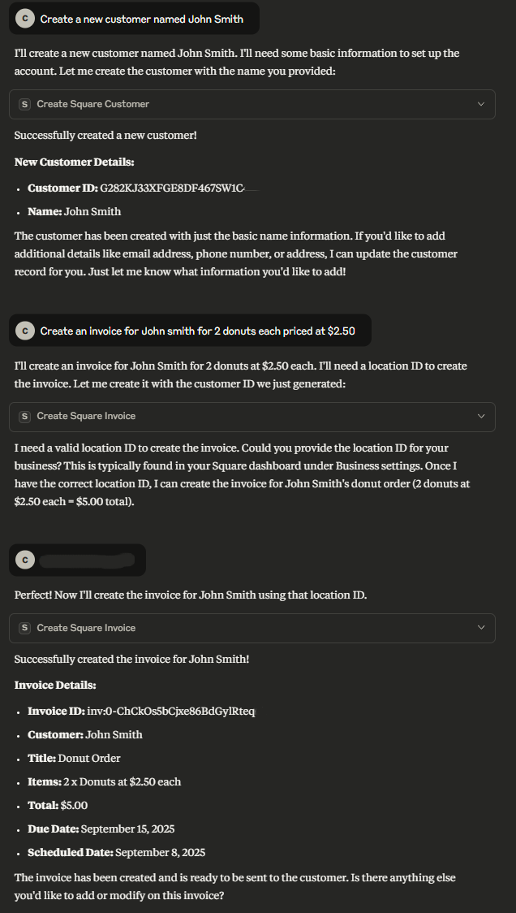

# smallbiz-mcp-server

**smallbiz-mcp** is a TypeScript-based MCP server for small business operations, including calendar, CRM, sales, and marketing.

> **Note:** Currently, smallbiz implements CRM tools from Square for invoice and customer management and calendar data from Google. Additional tools and resources for sales and marketing will be added soon.

---

## Features

- **Google Calendar Integration**
  - Interface with Google Calendar data
  
- **Square CRM**
  - CRUD operations for Square customers
  - CRUD operations for Square invoices

---

## Resources

### Square

- **Customers**
  - List all: `square://customer/listAll`

### Google

- List next 30 events: `google://calendar/events/list`

---

## Tools

### Core

- **`ping`**  
  Basic ping tool. Always returns `'pong'`.
- **`healthcheck`**  
  Verifies server and backend dependencies (Redis, Postgres).

### Square

- **`lookupSquareCustomerByEmail`**
  Search a Square customer by email.
   _Parameters:_ email
   _Returns:_ Customer details

- **`lookupSquareCustomerById`**
  Search a Square customer by customer ID.
   _Parameters:_ customerId
   _Returns:_ Customer details

- **`createSquareCustomer`**  
  Create a customer in Square.  
  _Parameters:_ givenName, familyName, emailAddress, address, phoneNumber, referenceId, note  
  _Returns:_ Confirmation with customer ID

- **`updateSquareCustomer`**  
  Update a Square customer.  
  _Parameters:_ customerId, address, birthday, company_name, email_address, family_name, given_name, nickname, note, phone_number, reference_id  
  _Returns:_ Confirmation with customer ID and timestamp

- **`deleteSquareCustomer`**  
  Delete a Square customer.  
  _Parameters:_ customerId  
  _Returns:_ Confirmation with customer ID

- **`listInvoices`**
  Display all Square invoices by location ID.
   _Parameters:_ locationId
   _Returns:_ All invoices for a single location

- **`lookupSquareInvoiceById`**
  Search a Square invoice by invoice ID.
   _Parameters:_ invoiceId
   _Returns:_ Invoice details

- **`lookupSquareInvoiceByCustomer`**
  Search a Square invoice by customer ID and location ID.
   _Parameters:_ customerId, locationId
   _Returns:_ Invoice details

- **`createSquareInvoice`**  
  Create an invoice in Square.  
  _Parameters:_ locationID, invoiceTitle, invoiceDescription, invoiceScheduledDate, customerId, invoiceDueDate, invoiceItems, serviceCharge, tax, discount  
  _Returns:_ Confirmation with invoice ID

- **`updateSquareInvoice`**  
  Update a Square invoice.  
  _Parameters:_ acceptedPaymentMethods, paymentRequests, primaryRecipient, deliveryMethod, description, invoiceNumber, locationId, orderId, saleOrServiceDate, storePaymentMethodEnabled, title  
  _Returns:_ Confirmation with invoice ID

- **`deleteSquareInvoice`**  
  Delete a Square invoice.  
  _Parameters:_ invoiceId  
  _Returns:_ Confirmation with invoice ID

### Google

- **`lookupGoogleCalendarEventById`**
  Search for a Google Calendar event by event ID.
   _Parameters:_ eventId
   _Returns:_ Calendar event details

- **`createGoogleCalendarEvent`**  
  Create a Google Calendar event.  
  _Parameters:_ eventTitle, eventDescription, eventStartDate, eventStartTime, eventEndDate, eventEndTime, attendees  
  _Returns:_ Confirmation, event details, and event link

- **`updateGoogleCalendarEvent`**  
  Update a Google Calendar event.  
  _Parameters:_ eventId, eventTitle, eventDescription, eventStartDate, eventStartTime, eventEndDate, eventEndTime, attendees  
  _Returns:_ Confirmation, event details, and event link

- **`deleteGoogleCalendarEvent`**  
  Delete a Google Calendar event.  
  _Parameters:_ eventId  
  _Returns:_ Confirmation

---

## Prompts

- _TBD_

---

## Development

**Install dependencies:**
```bash
npm install
```

**Build the container:**
```bash
docker compose up -d
```

**Verify images:**
```bash
docker compose logs postgres
```

**Run Prisma migration:**
```bash
npx prisma migrate dev --name init
```

**Update Prisma client:**
```bash
npx prisma generate
```

**Build the server:**
```bash
npm run build
```

**Development with auto-rebuild:**
```bash
npm run watch
```

**Test with MCP Inspector:**
```bash
npm run build
npx @modelcontextprotocol/inspector build/mcp.js
```

---

## Installation

To use with **Claude Desktop**, add the server config:

- **MacOS:** `~/Library/Application Support/Claude/claude_desktop_config.json`
- **Windows:** `%APPDATA%/Claude/claude_desktop_config.json`

```json
{
  "mcpServers": {
    "smallbiz-mcp-server": {
      "command": "/path/to/smallbiz-mcp-server/build/mcp.js"
    }
  }
}
```

---

## Debugging

MCP servers communicate over stdio, which can make debugging challenging.  
We recommend using the [MCP Inspector](https://github.com/modelcontextprotocol/inspector):

```bash
npm run inspector
```

The Inspector provides a URL for browser-based debugging tools.

**Run debug tools scripts:**
```bash
node --loader ts-node/esm debug_tools/<script_here>
```

---

## Other Notes

- For non-Windows machines, update the dev line in `package.json` to:
  ```
  "dev": "npx nodemon --watch src --ext ts --exec ts-node src/index.ts"
  ```
- Use `npm install @modelcontextprotocol/sdk zod@3` (not `zod@latest`) to avoid compiler errors.
- **Google Calendar integration:**
  - [Follow these steps](https://developers.google.com/workspace/calendar/api/quickstart/nodejs)
  - Create an external app
  - Add your email as a test user
  - If you subscribe to Google Workspace, you can set the app as internal.

 - The MCP server may be unable to see your Google credentials. If so, add them to your .env file as an absolute path under GOOGLE_CREDENTIALS_PATH and GOOGLE_TOKEN_PATH.

Examples:

## Example Screenshot

